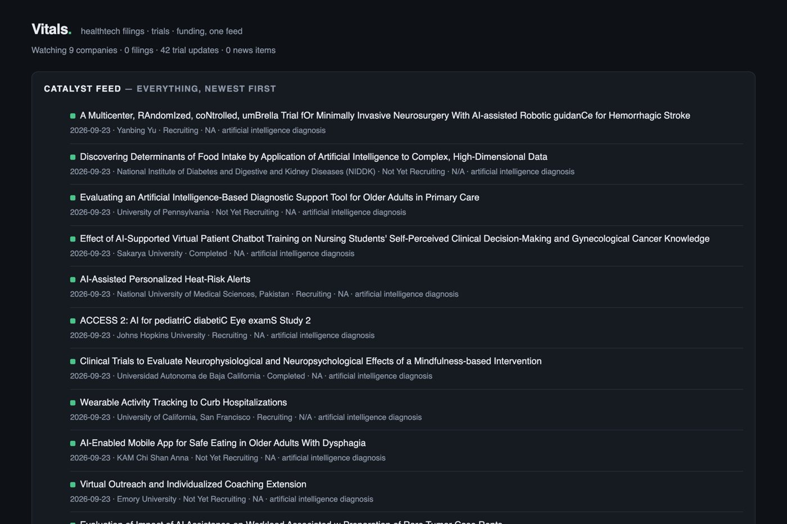

# Vitals

**The vital signs of a healthtech watchlist, in one feed.**

If you follow public digital-health companies as an investor, the things that
actually move a position rarely show up in one place. A company files an 8-K
with the SEC. A trial it depends on changes status on ClinicalTrials.gov. A
competitor raises a big round and it's in the trade press. Each of those is a
*catalyst*, and each lives on a different website that never talks to the others.

Vitals checks all three and merges them into a single, dated feed, the way you'd
check a patient's vitals: one glance to see whether anything has changed and
whether it needs a closer look.



## What it tracks

| Signal | Source | What it tells you |
| --- | --- | --- |
| **Filings** | SEC EDGAR | 8-K, 10-Q, 10-K, S-1 and other material filings for each ticker on your watchlist, so earnings, guidance changes, offerings and management changes surface the day they're filed. Ownership noise (Forms 3/4/5) is filtered out. |
| **Trial updates** | ClinicalTrials.gov | Recently updated studies for the themes you care about (by default digital therapeutics, remote patient monitoring and AI diagnosis): new trials, status changes, completions. |
| **Funding and deals** | Healthtech RSS feeds | Raises, acquisitions, mergers and IPOs from the trade press, keyword-filtered so general news stays out. Useful for reading the private market around the public names: who is getting funded, and at what scale. |

The default watchlist is nine US-listed digital-health names (Hims & Hers,
Teladoc, iRhythm, Butterfly Network, Progyny, Phreesia, Outset Medical,
TransMedics, Doximity). It lives in [`vitals/config.py`](vitals/config.py),
along with the trial search terms and news feeds, and all of it is meant to be edited.

## Run it

```bash
pip install -r requirements.txt

# the SEC asks API users to identify themselves with a contact email
export VITALS_CONTACT="you@example.com"

python -m scripts.refresh          # pull live data into vitals.db
uvicorn vitals.app:app             # open the dashboard on http://127.0.0.1:8000
```

No API keys needed: all three sources are public. Run the refresh on a schedule
(cron, launchd, a GitHub Action) and the feed keeps itself current; refreshes are
idempotent, so running one twice changes nothing.

To try it without touching the network, use the bundled sample data:

```bash
VITALS_OFFLINE=1 python -m scripts.refresh
VITALS_OFFLINE=1 uvicorn vitals.app:app
```

## How it works

1. **Fetch.** Each source has its own module in `vitals/sources/`. They fail
   independently, so a dead RSS feed or an SEC hiccup never stops the others landing.
2. **Normalise.** Filings, trials and news are three very different formats
   (EDGAR JSON, ClinicalTrials.gov JSON, RSS XML). Each is converted as early as
   possible into one shared event shape: source, reference, company, title,
   detail, date and link. Everything after this point only knows that shape, so
   adding a fourth source means writing one function.
3. **Store.** Events go into SQLite with a `UNIQUE(source, ref)` constraint, so
   duplicates are dropped by the database rather than by hand-written checks.
4. **Show.** A small FastAPI app renders the merged feed, newest first, with
   server-side templates and a little CSS. No frontend framework: for a read-only
   dashboard that is simpler to run and easier to reason about.

## Tests

```bash
python -m pytest
```

Parsing is kept separate from fetching, so the whole suite runs offline against
recorded responses in `tests/fixtures/`.

For a file-by-file tour of the code and the reasoning behind the design, see
[docs/WALKTHROUGH.md](docs/WALKTHROUGH.md).

## Roadmap

- [ ] Price and volume context next to each ticker, to see whether the market reacted
- [ ] A daily email or Slack digest of new catalysts
- [ ] Per-company pages that join filings, trials and news
- [ ] Tagging each catalyst as likely positive or negative for the position

## Data

Filings from [SEC EDGAR](https://www.sec.gov/edgar), trial records from
[ClinicalTrials.gov](https://clinicaltrials.gov), both public US government
sources. News comes from the publishers' public RSS feeds and links back to the
original articles.

MIT licensed. By [Euan Brown](https://euanbrown08.github.io).
